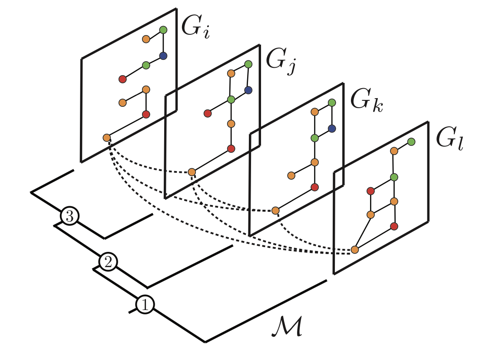

# Hypergraph Extensions for Biololgical Networks

Nel corso degli ultimi anni lo sviluppo del \textit{deep learning geometrico} ha portato ad una importante crescita degli studi riguardo le capacità di queste reti neurali nella risoluzione di complessi problemi legati ai grafi e ai sistemi rappresentabili come reti. Tuttavia, nonostante l'elevato potenziale di questi modelli rispetto a quelli tradizionali, la capacità di queste particolari reti neurali, così come per le reti tradizionali, è comunque influenzata dalla qualità e dalla struttura dei dati sui quali lavorano.

In questo lavoro, si andrà a considerare un possibile metodo per arricchire i grafi utilizzando i pattern strutturali nascosti per migliorare le performance di diversi task applicati ad essi; in particolare ci focalizzeremo sulle PPI network, i cui nodi rappresentano delle proteine e gli archi descrivono una interazione o una certa soglia di similarità tra le proteine. Lo scopo è enfatizzare l'importanza dei motif, e più nello specifico di questo lavoro, le clique di diversa taglia, come pattern strutturale per le reti biologiche.



## Installazione

```
python3 -m pip install -r requirements.txts
```

## Riproduzione degli esperimenti

```
python3 .
```
